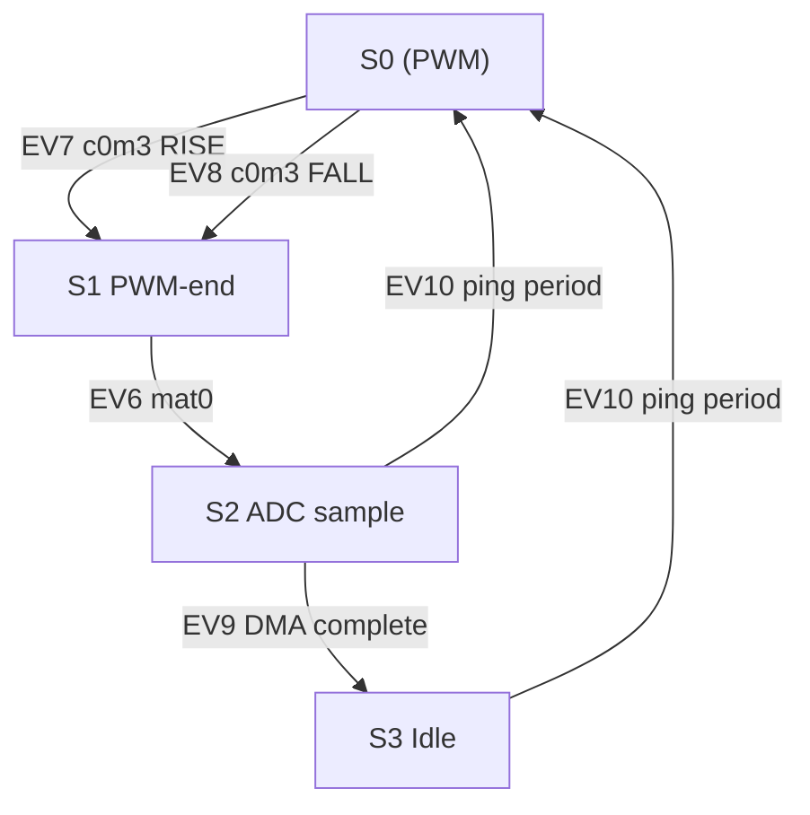
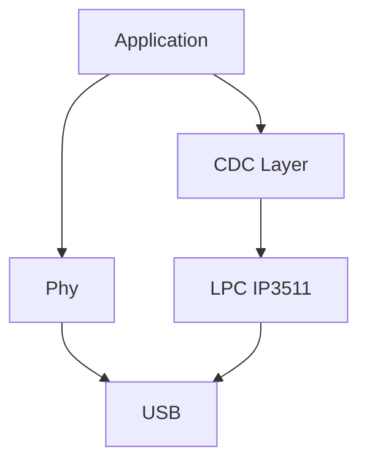
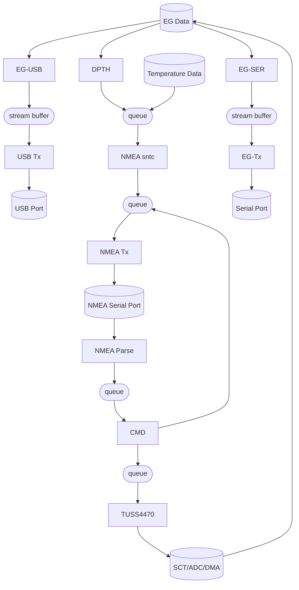

## Timing
The pings are timed by CT0. MAT0 (internal trigger), and MAT3 (routed on the board to SCT_GPI5) are used to change state of the SCT. MAT0 is used for the ping period (match at 'b' in the diagram below), MAT3 is used for the burst length (match at 'a').

The normal counter/timers can only set, clear or toggle their match pins, so for the burst end pulse, we have to configure the SCT to transition on either edge of MAT3 output.

The SCT (described below) is used to create the PWM needed for the burst, and to create a sample clock for the ADC. As it's name implies, the SCT is a state machine timer (state configureable timer). The States are shown below as S0 thru S3.

```wavedrom
{signal: [
            {},
            {name:'ct0',wave:['pw',{d:['m',0,0,'l',13,2,'v',-2,'l',13,2]}],
                node:'..a..........b'
                
                },
            {name:'mat3',wave:'2.2............2..'},
            {name:'burst',wave:'x.10.........x.10.'},
            {name:'adc',wave:'0..2........0...2.',node:'............c'},
            {node:'A.BC........DE.F'}
        ],
        edge: [
            'A+B S0',            
            'B+C S1',
            'C+D S2',
            'D+E S3',
            'E+F S0'
        ]
}
```

The PWM burst and subsequent ADC sampling is timed using the SCT. The different States:
- **State 0**: Generates a dual signal complimentary PWM signal with no overlap.
- **State 1**: Finishes the PWM by returning both SCTOUTx signals high
- **State 2**: Generates sampling period for ADC
- **State 3**: Wait for next pulse period
  
In each state, some combination of events is enabled to control the SCT. We definte the following events:
- **EV 0**: match0 (burst period/reset counter)
- **EV 1**: match1 (SCTOUT1 set)
- **EV 2**: match2 (SCTOUT1 clear)
- **EV 3**: match3 (SCTOUT0 set)
- **EV 4**: match4 (SCTOUT0 clear)
- **EV 5**: match5 (ADC sample rate/trigger and reset counter)
- **EV 6**: match0 (transition to S2)
- **EV 7**: CT0-MAT3->SCT_GPI5 (state transition to S1) RISING EDGE
- **EV 8**: CT0-MAT3->SCT_GPI5 (state transition to S1) FALLING EDGE
_Note_: We can't pulse MAT3 high, only toggle. This means we need to events to detect either rise/fall edge for our state transition.
- **EV 9**: DMA0 complete/SEV instruction (clear timer and state change)
- **EV 10**: CT0-MAT0 (state transition to S0)


The uses of the match registers:
- **match0** - reset counter (burst frequency and ADC sample rate)
- **match1** - rising edge of SCTOUT1
- **match2** - falling edge of SCTOUT1
- **match3** - rising edge of SCTOUT0
- **match4** - falling edge of SCTOUT0
- **match5** - ADC trigger and reset counter



The events that are enabled in each state are shown in the table below. These, combined with the CT0 and DMA0 interrupts control the transitions through our state machine and the operation of the SCT (what pins to set/clear for PWM) in each state.

|State | Name   |EV0 | EV1 | EV2 | EV3 | EV4 | EV5 | EV6| EV7| EV8| EV9|EV10|
|-     |-       |-   |-    |-    |-    |-    |-    |-   |-   |-   |-   |-   |
|0     |PWM     |  X |  X  |  X  |  X  |  X  |     |    |  X | X  |    |    |
|1     |PWM-fin |    |  X  |     |  X  |     |     |  X |    |    |    |    |
|2     |ADC     |    |     |     |     |     |  X  |    |    |    | X  | X  |
|3     |IDLE    |    |     |     |     |     |     |    |    |    |    | X  |

_Note_: We enable event 7 in state 2 so that even if DMA/ADC are not running, we transition back to bursting

State 0 and 1 have the heaviest use of events to generate our two complementary PWM signals (see below).

```wavedrom
{signal: [
  {},
  {name: 'timer',   wave: ['pw',{d:['m',0,0,'h',2,'l',8,2,'v',-2,'l',8,2,'v',-2,'l',8,2,'v',-2,'l',8,2,'v',-2,'l',8,2,'v',-2]}],
   						node:'.....bc..da.......................k.......l'
  },
  {name: 'SCTOUT1',    wave: 'h....0....1..0....1..0....1..0....1.......', node:'.....e....f..g'},
  {name: 'SCTOUT0',    wave: 'h.0...1..0....1..0....1..0....1..0....1...', node:'..h...i..j'},
  {node:'..A.......B'},
  {node:'..C...............................D.......E'},
],
  edge:[  	
    'A+B period (match0)',    
    'b-|e match2',
    'c-|i match3',
    'd-|j match4',
    'a-|f match1',
  	'C+D state0',    
    'D+E state1',    
	],    
  }
    
```
## Echograph
The echograph is produced by sampling the ADC starting at the end of the ping and ending sometime before the next ping.

The ADC can be triggered by the SCT. In the SCT state diagram above, State 2 creates the ADC sample rate. The ADC can be triggered by SCT outputs 4, 5 or 6. In event 5 of the SCT (triggered by MAT5 when we're in the ADC state), we select output 4 to occur when the match occurs.

Since the ADC will create a sample on every rising edge of the SCT input, and the SCT can only be set to toggle pins, we have to set the SCT match configuration for twice our desired sample rate (eg 100kSps -> set SCT for 200kHz).

The DMA is configured so that it is triggered by the ADC FIFO threshold. Since each DMA transfer can be at most 1024 bytes, we set up the DMA for linked list mode to allow for larger overall transfers. Samples are moved from the ADC FIFO to SRAM by the DMA, and a DMA interrupt is generated when our total request transfer is done.

There are a few oddities with the DMA engine:
- The first DMA transfer is configured through registers, and the follow-on ones through linked list items. This just makes setting up the list annoying...
- The hardware trigger (that starts the first register-based transfer) must NOT be set to clear the trigger condition, or the following list items are not performed. The last list item is set to clear the trigger and generate an interrupt.

## USB
The delineation between the NXP USB "driver" and our firmware is a little complicated. The NXP provided files are:
- usb/device/*
- usb/include/*
- usb/phy/*

Under `usb/device` exists `usb_device_lpcip3511.*` files which are the actual drivers for the peripheral device. The remainder of the files (excluding `usb/phy` are helpers for a generic implementation of the CDC device class).

`usb/phy` contains an EHCI compliant phy layer implementation (matches the phy peripheral on the LPC55xx HS usb). Currently the only function used from this is the "init" function during the hardware init at startup.



### Setup
To implement a virtual COM port using the above provided layers, we have to:
- Init the phy
- Init the clocks for the USB HS device
- Call `USB_DeviceClassInit()` to get a handle to the configured USB device class.
- Write a usb **device** callback (passed to above device class init function). This has to handle all the generic _device_ specific USB requests (getting descriptors, setting interfaces/settings) that are common to all USB devices. Additionally, since some of the descriptors are different between FS and HS devices, we need some support functions to switch between them when the enumeration processes is completed. Because of the structure of the driver, these things have to be changed in two places -- once in the actual binary descriptor array, and once in the descriptor structures that are used by the CDC driver layer. Specifically, we need to change:
  - Bulk (data) Endpoint max packet size between 64 and 512 for FS/HS
  - Interrupt (control) endpoint polling interval      
- Write a usb **CDC class** callback (passed to the device init in the class configuration structure) to handle all of the _cdc class_ specific functionality (line coding, control line states, etc).
- Call the driver `USB_DeviceLPCIp3511IsrFunction()` from the USB1_IRQHandler
- Enusre USB_STACK_USE_DEDICATED_RAM is set to 1 in project settings. This places key pieces of the driver into the 0x4010xxxx memory location where USB_RAM exists. The only memory writable by the USB peripheral is in this region.
- When everything is set up, call `USB_DeviceRun()`

If all of this is done correctly, the basic device enumeration functionality should work. 

### Receive
To receive data, the CDC callback will get an event. In this function we use `USB_DeviceCdcAcmRecv()` to pull data from the endpoint. This data then gets posted to a FreeRTOS stream buffer. We then re-submit a buffer to receive again.
_Note:_ Because we're calling FreeRTOS functions from the ISR, the priority of the ISR must be set appropriately.

### Transmit
To transmit data, we call `USB_DeviceCdcAcmSend()`. This call can fail if there is a transfer still underway. For this reason, when a transfer is completed, we post a task notificition to the USB Tx task. This task just monitors a stream buffer, and when data is available, tries to send it, waiting on a task notification if the send fails.

### Buffering
The driver will use buffers as-is _as long as they reside in the USB_RAM section_. If not, the data is memcpy'd to regions in the USB_RAM area. For efficient use of the driver, put the buffers in that area.
Secondly, when instructed to receive 512 bytes of data, and only 1 byte is received, the driver passes that 1 byte up through the layers, but also re-queues (by copying...) the remainder of the buffer. Haven't found a good workaround for this, and it seems inefficient. It might not be an issue when sending (mostly) full frame buffers.

## Depth Detection
The depth is determined by a (fairly) simple threshold detection. The raw echogram data is filtered using an IIR filter. The filtered value has a "threshold adder" (from EEPROM environment) add to it. If the echogram exceeds this calculated threshold for more than 80% of the expected pulse length, a reflection is deemed to be 'found'.

The IIR filter coefficients are derived dynamically from the pulse length. For a first order filter, the time constant ($\tau$) is equal to:
```math
a = e^{-\frac{1}{\tau}}
```
Where *a* is related to the IIR equation by:
```math
y[n] = (1-a)x[n] + ay[n-1]
```
Since $\tau$ represents the time for the signal to settle to roughly 66% of the final value, any rectangular(ish) reflection from our transmitted pulse should stay at least 34% higher than the travelling threshold for the entire reflected ping time. Note that we need to operatin in samples, so $\tau$ is calculated from: $$ \tau = pinglen \cdot samplerate $$

## Tasks
There are a number of tasks running during normal operation:
- IDLE - the normal FreeRTOS idle task. When sending data over USB, this occupies about 50-70% of the CPU
- Tmr Svc - internally used by FreeRTOS for timers -- not currently used in this application
- tuss4470 - Handles configuration of the TUSS4470 and SCT (for ping generation) and monitors a queue to allow other tasks to reconfigure aspects of the tuss4470 and ping generation. Usually occupies very little CPU.
- CMD - task that handles parsing of the NMEA style commands. Gets commands from a message queue, and posts NMEA style replies to the NMEA transmit queue.
- USB Tx - Receives arbitrary data from a stream buffer, and sends it out the USB port (if anything is connected). This task can occupy 5-8% of the CPU when transmitting to a PC.
- EG-USB - handles echogram data for transmission out the USB port. This task send full bandwidth echogram data to a stream buffer (for the USB Tx task) for transmission to the PC
- EG-SER - handles echogram data for tranmission out the serial port. This task downsamples the raw echogram data to fit within the configured baud rate of the serial port (optimized for 95% use). Posts data to a stream buffer for transmission to a serial port via the EG-Tx task. This task takes a few percent of the CPU to achieve the downsampling.
- EG-Tx - receives data from a stream buffer and sends to the serial port.
- DPTH - this task parses the raw echogram data to find the first reflection for depth calculation. The task only parses until it finds the first depth, so in 'shallow' states, it will only use a few percent of the CPU. For no echo (ie, parses the whole echogram), it can use around 35% of the CPU.
- NMEA Tx - receives sentences from a queue and sends them out the NMEA port
- NMEA sntc - When depth/temperature information is available (from queue), builds NMEA sentences and posts them to the NMEA tx queue.
- NMEA Parse - receives serial NMEA commands from the port and sends commands to the command message queue.

Some tasks seem superfluous, but were added to allow easy expansion. For example, if a virtual NMEA serial port was added to the USB layer, then commands to the CMD task are easily able to come from two sources -- the NMEA Parse task, and a second USB Parse task.

